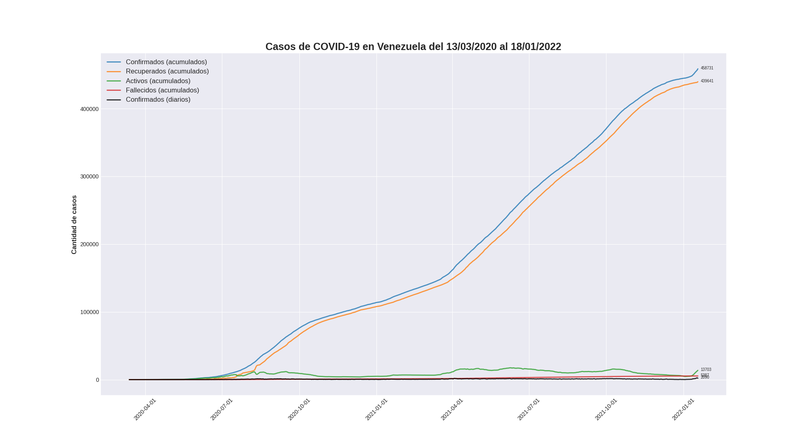
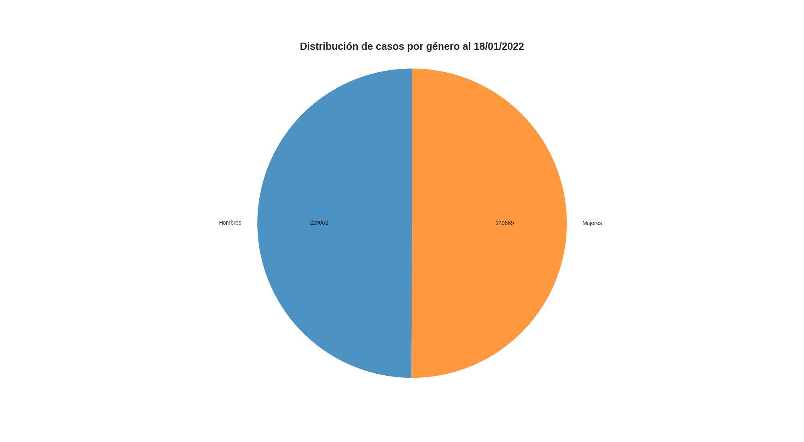

# corona_ve

Script en Python para generación de gráficos referentes a los casos de COVID-19 en Venezuela utilizando el API de covid19.patria.org.ve

----

## Requerimientos:

* matplotlib
* numpy
* pandas

----

## Entrada del terminal (ejemplos):

* Forma predeterminada, mostrará los datos desde el primer registro hasta el último ofrecido por la API.

    `python corona_ve.py`

* Un solo argumento, mostrará los datos desde la fecha introducida hasta el último ofrecido por la API.

    `python corona_ve.py 2022-01-01`

* Dos argumentos, mostrará los datos entre los rangos de fecha introducidos.

    `python corona_ve.py 2021-01-01 2021-12-31`

----

## Salida del terminal:
    
    Casos COVID-19 en Venezuela
    ===========================
    Confirmados:     458731
    Recuperados:     439641
    Fallecidos:      5387
    Activos:         13703

    Estadísticas
    ===========================
    Letalidad:      1.17%
    Recuperación:   95.84%

    Casos del día  18/01/2022
    ===========================
    Confirmados:     2090
    Recuperados:     919
    Fallecidos:      4
    
----

## Gráficos:

----

Datos adquiridos desde https://covid19.patria.org.ve/api-covid-19-venezuela/

