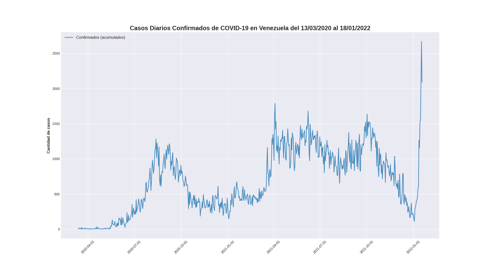
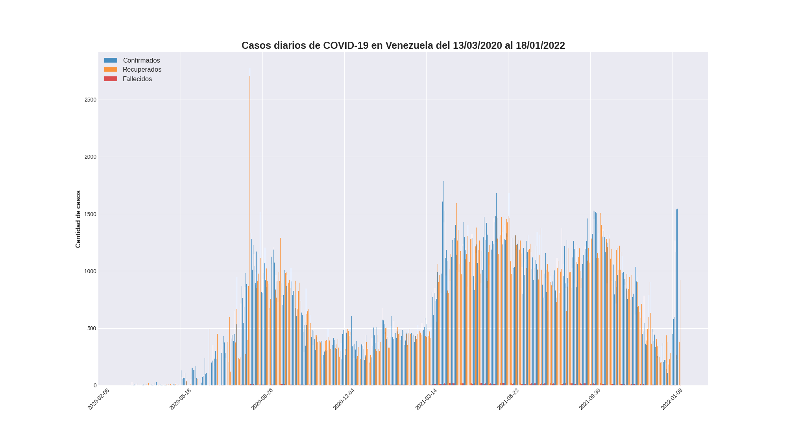

# corona-ve-sns

Script en Python para generación de gráficos referentes a los casos de COVID-19 en Venezuela utilizando el API de covid19.patria.org.ve

----

## Requerimientos:

* seaborn
* matplotlib
* numpy
* pandas

----

## Muestra:

----

## Salida del terminal:
    
    Casos COVID-19 en Venezuela
    ===========================
    Confirmados:     175
    Recuperados:     93
    Fallecidos:      9
    Activos:         73
    
    Nuevos casos al 11/04/2020
    ===========================
    Confirmados:     0
    Recuperados:     9
    Fallecidos:      0 
    
    Estadísticas
    ===========================
    Mortalidad:     5.14%
    Recuperación:   53.14%
    

----

Datos adquiridos desde https://covid19.patria.org.ve/api-covid-19-venezuela/
